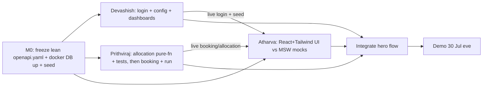

# Team Implementation Plan — Working Prototype

**Objective:** a demoable prototype by **30 Jul 2026, evening** (deadline set 28 Jul). Three people building
in parallel. Phase detail is in [`phases-3-6-plan.md`](phases-3-6-plan.md); this doc is the **who / when /
how-we-parallelize** layer.

**Team:** Atharva (Frontend), Devashish (Backend — Platform & Admin), Prithviraj (Backend — Booking &
Allocation).
**UI stack:** **React + TypeScript + Tailwind CSS** (Vite). *(Optional accelerator: shadcn/ui — Radix +
Tailwind — for ready-made accessible components without leaving Tailwind. Team's call.)*

> ⏱️ **Reality check.** ~2.5 working days is very tight. This plan hits the deadline by shipping a **hyper-MVP
> hero flow** and pushing everything else to fast-follows (see §6 cut-list). If the demo needs more than the
> hero flow, the deadline has to move — flag now, not on the 30th.

---

## 1. Definition of Done — the demo hero flow
"Done" = this runs end-to-end on one `docker compose up` with seeded data, on 30 Jul evening:
1. A **user logs in** (seeded) and submits a **next-weekday booking** (manual `distanceKm` + carpool count).
2. A second seeded user submits a competing booking.
3. **Primary allocation** is triggered (a Super-Admin "Run allocation" button) → produces **allocations + a
   waitlist ranked by the real `FinalScore`**, with the **score breakdown** shown in the UI.
4. Company/slot/quota setup and **timings/weights** are visible and editable (config screen — D8).
5. *(If time)* an allocated user **releases** → own-company waitlisted user is promoted (F3); in-app
   notification appears.

Steps 1–4 = the demo. Step 5 + everything in §6 are fast-follows.

---

## 2. Tracks & ownership

### 🎨 Atharva — Frontend (design, development, testing) — *entire UI, nothing else*
- **Vite + React + TS + Tailwind** scaffold, minimal design tokens, layout shell, role-based routing.
- Hero-flow screens: **Login**, **User booking form** (distance + carpool), **Allocation results + score
  breakdown**, **Config/timings screen**, minimal **dashboard counts**.
- Typed API client, react-hook-form + zod, loading/empty/error states, in-app notification toast *(if time)*.
- **Mock-first** against `openapi.yaml` (MSW) → swap to live per endpoint. Never blocked by backend.
- Lightweight RTL tests on the booking form + results render (time-boxed).

### ⚙️ Devashish — Backend: Platform & Admin
- `backend/` scaffold, `.env.example`, **Docker Compose** (postgres + redis + backend), Prisma **migrate +
  seed** running with rich demo data (companies, slots, quota, users).
- **`openapi.yaml`** for the hero endpoints only (lead author, with Prithviraj) — freeze at M0.
- **Auth**: seeded-user **login + JWT** (⚠️ refresh-token rotation **deferred** to fast-follow — plain
  short-lived JWT for the demo) + role/tenant guard.
- **Config service** (`SystemConfiguration` read/update + timing-order validation — D8) + **dashboard read
  APIs**. Company/Slots/Quota exposed read-only for the demo (setup comes from seed, not UI).

### 🧮 Prithviraj — Backend: Booking & Allocation
- **Allocation engine first, as a pure function** (scoring formula per decisions §3 + 5 tie-breakers) with
  **unit tests** — no DB needed, so it starts on Day 0 immediately.
- **Booking** create endpoint (distance snapshot + carpool count) + list/status.
- Wire allocation to DB inside a **transaction + `SELECT … FOR UPDATE`**, `AllocationRun` state machine,
  **manual "run primary allocation" endpoint**, results + breakdown endpoints.
- In-app notification on allocation/release *(if time)*.

> Shared contract = `openapi.yaml` + the finished Prisma schema. Backend devs agree on repo/service
> interfaces at M0 so Prithviraj stubs Devashish's config/slot reads and doesn't wait.

---

## 3. Parallelization (contract-first)
Schema is done; freeze the **lean API contract** before full-speed work.

---

## 4. Compressed schedule (half-day blocks to the deadline)

| When | Atharva | Devashish | Prithviraj |
|------|---------|-----------|------------|
| **28 Jul – PM/eve (M0)** | Scaffold Vite+React+Tailwind; layout + routing; **freeze lean `openapi.yaml`** (joint); MSW mocks; Login page | Backend scaffold + **Docker + Prisma migrate + seed running**; author `openapi.yaml` (lead); start login | **Allocation pure-fn + unit tests** (formula + tie-breakers); scaffold booking |
| **29 Jul – AM (M1)** | Booking form + Config screen on mocks | Finish **login + JWT + guard**; Config read/update APIs | Booking create/list endpoints; start DB-wired allocation (txn) |
| **29 Jul – PM (M2)** | Allocation-results + breakdown UI on mocks; **wire Login to live** | Dashboard read APIs; seed richer demo data; support FE integration | **"Run primary allocation" endpoint** + results/breakdown endpoints live |
| **30 Jul – AM (M3)** | **Wire booking + results + config to live**; hero flow green in browser | Integration fixes; tenant/role guard verification | Release→waitlist promotion + in-app notify *(if time)*; integration fixes |
| **30 Jul – midday (freeze)** | Joint: run the **golden-path script** end-to-end; bug bash; polish demo data | | |
| **30 Jul – evening** | **Prototype demo** | | |

**Milestone exits:** M0 = contract frozen + seeded DB up + all three scaffolded. M1 = live login + booking
persists + allocation unit-tested. M2 = allocation run + breakdown live; login wired in UI. M3 = full hero
flow green in the browser.

---

## 5. Testing (time-boxed to the deadline)
- **Prithviraj:** allocation/scoring unit tests **first** (the one area we won't hand-verify under pressure).
- **Devashish:** a smoke Supertest for login + one tenant-isolation negative test.
- **Atharva:** RTL on booking-form validation + results render.
- **Joint:** one scripted end-to-end golden-path pass at the 30 Jul midday freeze.

## 6. Cut for this deadline (fast-follows, not in the 30 Jul demo)
Common-pool flow · email/SMS/push delivery · reports + CSV · registration + approval **UI** (users are
seeded) · email verification + password reset · **refresh-token rotation** (plain JWT for demo — tech debt) ·
blocking UI · audit UI · slot/quota/company **management UI** (seed-driven). All are already designed in
[`phases-3-6-plan.md`](phases-3-6-plan.md) and can follow immediately after the demo.

## 7. Resolved decisions & risks
- ✅ **UI = React + Tailwind** (Vite). ✅ **Deadline = 30 Jul evening.** ✅ **Scope = hero flow only** (§1, §6).
- **Risk — time:** 2.5 days is aggressive; the cut-list (§6) is what makes it feasible. Adding anything back
  risks the date.
- **Risk — allocation correctness:** mitigated by unit-testing the pure function on Day 0.
- **Risk — integration crunch:** mitigated by Atharva swapping mocks→live per endpoint continuously.
- **Shortcut debt to repay after demo:** refresh-token rotation, full auth (register/verify/reset), audit
  coverage, and the §6 features.
