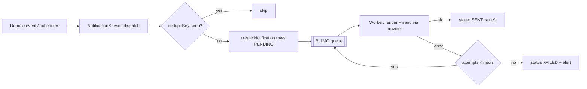

# Notification & Email Service — Concrete Plan

**Status:** design now (priority), **delivery implemented in Phase 4**. The data model
(`NotificationTemplate`, `Notification`) already exists in [`backend/prisma/schema.prisma`](../backend/prisma/schema.prisma);
this document specifies exactly how the service will use it so implementation is unambiguous.

---

## 1. Goals & principles
- **Channel-agnostic core.** One event → fan out to one or more channels. Adding a channel must not touch
  business code.
- **Template-driven.** Copy lives in the DB (`NotificationTemplate`), editable without a deploy; supports
  `{{placeholder}}` substitution.
- **Reliable & idempotent.** Sending runs on a queue with retries; a re-run of an allocation/scheduler job
  must never double-send (dedupe key).
- **Auditable & privacy-safe.** Every send is recorded; recipient PII is masked in logs; secrets live in env.
- **Configurable by Super Admin.** Channel on/off switches, from-address, per-event enablement — all in
  `SystemConfiguration` (consistent with D8).

## 2. Channels
| Channel | Phase | Transport |
|---------|-------|-----------|
| **In-app** | Now (Phase 4) | Rows in `Notification`; unread badge + list via REST; real-time push (SSE/WebSocket) is a later enhancement, polling is fine initially |
| **Email** | Now (Phase 4) | Pluggable email provider (see §4) |
| **SMS** | Later | Same provider abstraction, new adapter |
| **Push** | Later | Same provider abstraction, new adapter |

`NotificationChannel` enum already includes `EMAIL, IN_APP, SMS, PUSH`.

## 3. Data model usage (already in schema)
- **`NotificationTemplate`** — `code` (unique event key), `channel`, `subject`, `body` (with `{{vars}}`),
  `isActive`. One row **per channel per event** (e.g. `PRIMARY_SLOT_ALLOCATED` may have an EMAIL row and an
  IN_APP row).
- **`Notification`** — one row **per recipient per channel per event instance**: `userId`, `templateId`,
  `channel`, `status` (`PENDING → SENT | FAILED | READ`), rendered `subject`/`body`, `metadata` (JSON: the
  substitution vars + a `dedupeKey`), `sentAt`, `readAt`.

> **Idempotency:** `metadata.dedupeKey = {templateCode}:{userId}:{entityType}:{entityId}:{bookingDate}`.
> Before enqueuing, the service checks for an existing non-FAILED `Notification` with the same dedupeKey and
> skips if found. (A partial unique index on a generated `dedupeKey` column can enforce this at the DB level
> in Phase 4 if needed — noted, not added now.)

## 4. Provider abstraction
```
interface NotificationChannelProvider {
  channel: NotificationChannel
  send(msg: { to: Recipient; subject: string; body: string; meta?: Json }): Promise<SendResult>
}
```
- `EmailProvider` — one adapter behind the interface. **Provider decision deferred** (see §9); candidates:
  Amazon SES, SendGrid/Twilio, or plain SMTP. Config selects the active adapter; credentials come from env/
  secrets, never the DB.
- `InAppProvider` — writes/updates the `Notification` row (marks `SENT`); read state set via the in-app API.
- A `NotificationService.dispatch(eventCode, recipient, vars)` resolves active templates for the event,
  renders them, applies the dedupe check, and enqueues one job per channel.

## 5. Event catalog → template mapping
All template `code`s below are already seeded in `backend/prisma/seed.ts` (EMAIL channel; IN_APP rows added in
Phase 4). Trigger = where in the domain flow the event fires.

| Event (`code`) | Trigger | Recipient | Key placeholders |
|----------------|---------|-----------|------------------|
| `REGISTRATION_RECEIVED` | user completes registration | the user | `fullName` |
| `REGISTRATION_APPROVED` | Company Admin approves | the user | `fullName` |
| `REGISTRATION_REJECTED` | Company Admin rejects | the user | `fullName` |
| `BOOKING_SUBMITTED` | request submitted | the user | `bookingDate` |
| `BOOKING_CANCELLED` | request cancelled (by user/system) | the user | `bookingDate` |
| `PRIMARY_SLOT_ALLOCATED` | primary allocation publishes | allocated users | `bookingDate`, `slotNumber` |
| `PRIMARY_SLOT_NOT_ALLOCATED` | primary allocation publishes | waitlisted users | `bookingDate` |
| `COMMON_POOL_OPENED` | common-pool window opens | eligible users | `bookingDate`, `closeTime` |
| `COMMON_POOL_REQUEST_SUBMITTED` | common-pool request submitted | the user | `bookingDate` |
| `COMMON_POOL_SLOT_ALLOCATED` | common-pool allocation publishes | allocated users | `bookingDate`, `slotNumber` |
| `COMMON_POOL_SLOT_NOT_ALLOCATED` | common-pool allocation publishes | unfulfilled users | `bookingDate` |
| `SLOT_RELEASED` | user/admin releases a slot | releaser (+ reallocated user) | `bookingDate`, `slotNumber` |
| `BOOKING_REMINDER` | `reminderBefore` mins before cutoff | users with no submission | `cutoff` |

## 6. Delivery pipeline

- **Queue:** BullMQ on Redis (same infra as allocation jobs). Exponential backoff, capped attempts, dead-letter
  for exhausted jobs.
- **Batch events** (e.g. allocation results for hundreds of users) enqueue one job per recipient/channel so a
  single failure doesn't block the batch.
- **In-app read:** `PATCH /notifications/:id/read` sets `status = READ`, `readAt`.

## 7. Configuration (Super Admin) — seeded in `SystemConfiguration`
| Key | Default | Purpose |
|-----|---------|---------|
| `notification.email.enabled` | `true` | Master switch for email |
| `notification.inApp.enabled` | `true` | Master switch for in-app |
| `notification.email.fromAddress` | `no-reply@redbricks.example` | Default From |
| `booking.reminderBefore` | `60` (min) | When the reminder fires (D8) |

Provider name + credentials are **env/secrets** (e.g. `EMAIL_PROVIDER`, `SES_REGION`, `SENDGRID_API_KEY`), not
the DB. Per-event enable flags (`notification.event.<CODE>.enabled`) can be added in Phase 4 as needed.

## 8. Failure handling, security & observability
- **Retries/backoff** on transient send failures; dead-letter + alert on permanent failure.
- **PII masking:** log recipient as `a***@domain`; never log full body/PII. Address/contact masked (F12).
- **No secrets in DB or templates.** Bodies contain only non-sensitive, user-relevant data.
- **Metrics:** counts by channel/status, send latency, failure rate; `/health` covers queue + provider reachability.

## 9. Phasing & open decisions
**Phase 4 (delivery):** email + in-app adapters, template rendering, dedupe, BullMQ worker, retries, in-app
read API, the 13 seeded events.
**Later:** SMS/push adapters, real-time in-app transport (SSE/WebSocket), per-user notification preferences,
daily digests, localization of templates.

**Open decisions (to confirm before Phase 4):**
1. **Email provider** — SES vs. SendGrid vs. SMTP (cost, deliverability, ops familiarity).
2. **Real-time in-app** — polling now vs. SSE/WebSocket now.
3. **User preferences** — do users opt out of specific non-critical notifications (e.g. reminders)?
