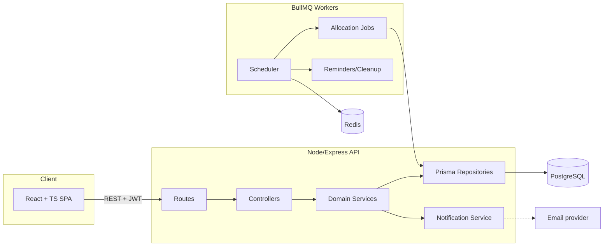
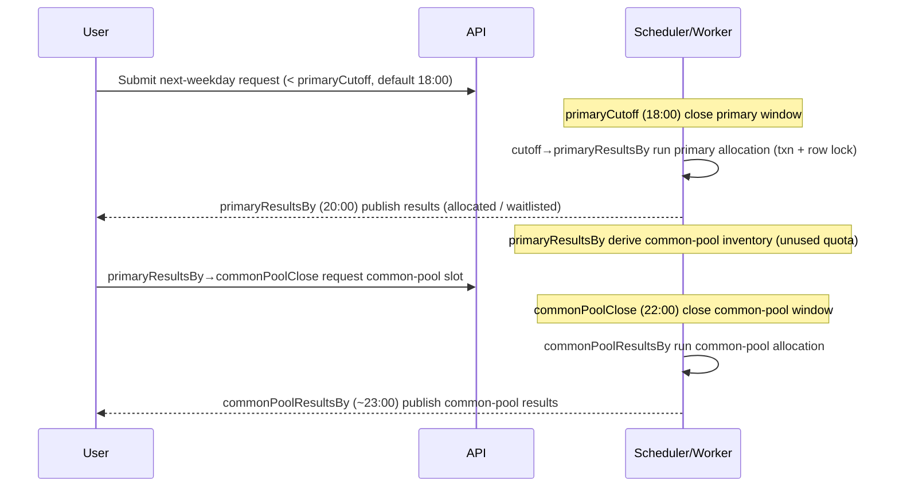
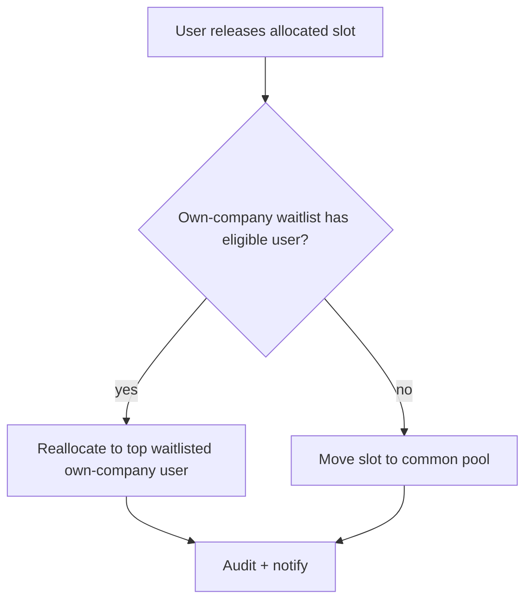

# Phase 1 — Requirements & Architecture

**Project:** Office Parking-Slot Booking Platform
**Building administrator (tenant of the platform):** Redbricks (Super Admin)
**Sample company tenant:** Assent
**Timezone for all scheduling:** Asia/Kolkata (IST)

> Read `docs/decisions.md` first — it records the locked decisions (quota slot model, concrete scoring
> formula, **no geolocation — manual distance entry**, Mon–Fri bookings, deferred attribute matching) and
> the resolutions this document builds on.

---

## 1. Refined functional requirements

### 1.1 Personas & core capabilities
- **Super Admin (Redbricks):** manages companies, physical slots, and company slot **quotas**; views global
  utilization; assigns/removes Company Admins; configures booking windows, weights, working days/holidays;
  can manually override allocations; views audit logs.
- **Company Admin:** manages their own company only — views their quota, blocks/unblocks a count of their
  quota (with reason) for a date/range, approves/activates company users, views bookings/allocation results/
  utilization for their company, and can release a booked slot on a user's behalf.
- **Company Registered User:** registers, verifies email, awaits approval, then submits a next-working-day
  parking request (with optional carpool members), views status, cancels before cutoff, views/releases the
  allocated slot, and can request a common-pool slot after primary allocation.

### 1.2 Registration
Fields: full name, company (dropdown of **active** companies), email (= username, unique), contact number,
address, PIN code, **distance from home to office in km (manually entered — D6)**, password, confirm
password. Validations: unique email (partial unique, see F7), valid contact number, valid PIN, `distanceKm`
within a sane range (e.g. 0–200), configurable password strength, company must be active, one company per
user, email verification required. Status lifecycle: `PENDING → ACTIVE | REJECTED | INACTIVE`.

### 1.3 Slots & quota (quota model — D2)
- Physical `ParkingSlot`s belong to an `OfficeLocation` → `ParkingArea`. They carry `slotType`, `status`,
  `hasEvCharging`, `isAccessible` (last two stored but **not** used by MVP allocation — D5).
- Super Admin grants each company an **effective-dated quota** (`CompanySlotAllocation`: count valid from a
  date, optionally until a date). Increasing/decreasing a quota = new effective-dated row.
- Company Admin can **block a count** of their quota for a date/range with a reason. Blocked count is
  excluded from both primary allocation and common-pool contribution.

### 1.4 Daily booking workflow (all times are Super-Admin config — D8; defaults shown)
Bookable days are **Monday–Friday** only; weekends are not bookable (D7). The booking targets the next
calendar weekday (Friday evening's window targets Monday). Holiday-calendar skipping is deferred. **No time
below is hardcoded** — each is a `SystemConfiguration` value the Super Admin can change at runtime (D8).
- **Primary window:** user submits/edits a request for the next bookable weekday until `booking.primaryCutoff`
  (default **`< 18:00` IST**, strict — F2). Primary allocation runs between cutoff and `booking.primaryResultsBy`
  (default 20:00), when results are published.
- **Common-pool window:** at `booking.primaryResultsBy` (default 20:00) unused company quota
  (quota − blocked − booked) becomes common-pool inventory and the pool opens. Users across companies request
  common-pool slots until `booking.commonPoolClose` (default 22:00); common-pool allocation is published by
  `booking.commonPoolResultsBy` (default ~23:00).
- **Release:** a user (or Company Admin on their behalf) may release an allocated slot. Before primary
  allocation the slot stays in the company pool; after primary allocation the **releasing company's own
  waitlisted users get first priority** (ranked by `FinalScore`), and only if none remain does the slot
  move to the common pool for other companies (F3). All releases/reallocations are audited.

### 1.5 Allocation algorithm (D3, D4) — concrete formula
Driver/owner is **person 1**; `People` includes the driver. Full definition + lookup tables in
`docs/decisions.md` §3.
```
DistanceScore = (min(DistanceKm, 40) / 40) × 100          # 0–100, cap = allocation.maxDistanceKm
CarpoolScore  = ((min(People, 4) - 1) / 3) × 100          # 0–100, cap = carpool.maxPeople
FinalScore    = 0.60 × DistanceScore + 0.40 × CarpoolScore
```
- `DistanceKm` = the user's **manually-entered** distance, snapshotted onto the booking (D6/F6).
- `People` = 1 (driver/owner, always counted) + **scored** carpool members. Only same-company employee
  members validated by email are scored (F4); the cap is `carpool.maxPeople` (default 4).
- Rank by `FinalScore` (desc). Allocate from the requesting user's company quota first. Exclude blocked/
  inactive slots. One slot per user per date; one user per slot per date. Unallocated users → **waitlist**.
- **Tie-breakers (in order):** (1) more People, (2) greater distance, (3) earlier submission time,
  (4) fewer allocations in previous 30 days *(fairness — D4)*, (5) secure random draw.
- Store per-factor scores + weights + `People` in `AllocationScoreBreakdown` so admins can explain any outcome.
- Weights, `maxDistanceKm`, and `maxPeople` are configurable via `SystemConfiguration`.

### 1.6 Distance (D6, F5, F6)
**No geolocation, geocoding, or map provider.** Each user enters a single `distanceKm` value (home→office)
on their profile; it is range-validated and **snapshotted** onto each `BookingRequest` (`travelDistanceKm`)
at submission so later profile edits don't change historical scores.

### 1.7 Working days (D7, F1)
Bookable days are **Monday–Friday**; weekends are not bookable. Dynamic "next-working-day" resolution and
holiday-calendar skipping are **deferred** (the `WorkingDayConfiguration` / `Holiday` tables are retained in
the schema for later use).

### 1.8 Notifications, dashboards, reports, audit
- **Notifications:** templated (registration received/approved/rejected, booking submitted/cancelled, primary
  allocated/not allocated, common-pool opened/submitted/allocated/not allocated, slot released, reminder).
  Channels: email + in-app now; extensible to SMS/push (`NotificationTemplate` + `Notification`).
- **Dashboards:** Super Admin (global slots/companies/utilization/trends), Company Admin (own quota/blocked/
  booked/common-pool/waitlist/utilization), User (upcoming booking, status, slot number, cutoff countdown,
  history, release action, profile).
- **Reports:** daily allocation, company utilization, user booking history, requests-vs-allocations,
  common-pool utilization, blocked/released history, frequent winners/waitlisted, carpool participation,
  score breakdown. Filter by date/range/company/user/slot/type/status; CSV export (async — F13, later phase).
- **Audit:** who/action/entityType/entityId/oldValue/newValue/timestamp/IP/correlationId, immutable.

---

## 2. Assumptions & open questions

**Assumptions:** single building/multiple office locations acceptable; one company per user; email delivery
provider chosen in a later phase; IST is the only operating timezone initially; "next working day" is the
only bookable horizon.

**Open questions (for later phases):** SLA/scale targets (concurrent users, slots) not yet specified;
notification email provider (SES/SendGrid?) undecided; whether Company Admins can pre-book on behalf of users;
consent-management approach for DPDP (F12).

---

## 3. Roles & permission matrix

| Capability | Super Admin | Company Admin | User |
|------------|:----------:|:-------------:|:----:|
| Create/edit/(de)activate companies | ✅ | ❌ | ❌ |
| Create/manage physical slots | ✅ | ❌ | ❌ |
| Allocate / change company quota | ✅ | ❌ | ❌ |
| View global utilization & all users | ✅ | ❌ | ❌ |
| Assign/remove Company Admin | ✅ | ❌ | ❌ |
| Configure **all** booking/allocation timings, weights, working days | ✅ | ❌ | ❌ |
| Manual allocation override | ✅ | ❌ | ❌ |
| View audit logs | ✅ | own company | ❌ |
| View own company quota/utilization | ✅ | ✅ | ❌ |
| Block/unblock quota (with reason) | ✅ | ✅ (own) | ❌ |
| Approve/(de)activate company users | ✅ | ✅ (own) | ❌ |
| View company bookings/allocations | ✅ | ✅ (own) | own only |
| Release a booked slot | ✅ | ✅ (own users) | own only |
| Register / verify email / login | — | — | ✅ |
| Submit/cancel booking; join common pool | ❌ | ❌ | ✅ |
| View/release own allocated slot | ❌ | ❌ | ✅ |

**Tenant isolation:** every Company Admin/User query is scoped by `companyId`; cross-company data is
inaccessible except explicitly-allowed common-pool inventory.

---

## 4. System architecture

**Stack:** React + TypeScript (FE), Node.js + Express + TypeScript (BE), PostgreSQL + Prisma, Redis + BullMQ
(jobs), JWT access + rotating refresh tokens (auth).

**Layering (clean architecture):** `routes → controllers → services (domain logic) → repositories (Prisma) → DB`.
Cross-cutting: auth/RBAC middleware, validation (zod), error handler, logger (with masking), audit interceptor.



---

## 5. Main modules
Auth · Users · Companies · OfficeLocations/ParkingAreas · Slots & Quota · Blocking · Booking · Allocation
(primary + common pool) · Notifications · Reports · Audit · Config · Scheduler.
*(No distance/geolocation module — distance is a manually-entered user field, D6.)*

---

## 6. Workflows

### 6.1 Primary + common-pool daily flow
Times shown are the **seed defaults**; every one is read from `SystemConfiguration` at runtime (D8), so the
Super Admin can shift any window without a redeploy. The scheduler reloads its trigger times from config and
reschedules when they change.


### 6.2 Slot release (post-primary)


### 6.3 Registration approval
`Register (PENDING) → verify email → Company Admin approves → ACTIVE` (or `REJECTED`). All transitions audited
and notified.

---

## 7. Security architecture (F10, F12)
- **AuthN:** short-lived access JWT (Bearer header) + opaque refresh token in HTTP-only/Secure/SameSite cookie,
  rotated on use with revocation tracking (`RefreshToken`). CSRF protection on cookie-based refresh/logout.
- **AuthZ:** role + tenant middleware; every company-scoped query filtered by `companyId`.
- **Password:** Argon2id (bcrypt acceptable fallback).
- **Hardening:** rate limiting, zod input validation, Prisma parameterized queries (SQLi-safe), output
  encoding (XSS), secure headers (helmet), env-based secrets, audit logging, PII masking in logs.

---

## 8. Recommended folder structure (for later phases)
```
parking-poc/
  docs/                 # this engagement's deliverables
  prisma/               # schema.prisma, migrations, seed.ts
  backend/              # Express app (routes/controllers/services/repositories), workers
  frontend/             # React + TS SPA
  docker-compose.yml    # frontend + backend + postgres + redis
  .env.example
```

---

## 9. Next phases (out of scope here → maps to spec Phases 3–6)
- **Phase 3 — API design:** REST endpoint list, request/response examples, validation & authorization rules,
  standard error format, OpenAPI spec.
- **Phase 4 — Backend:** Express + Prisma implementation, auth, booking, allocation service (txn + locking),
  config-driven BullMQ jobs (D8), notification **delivery** (per [`notification-service-plan.md`](notification-service-plan.md)),
  audit, tests, Docker.
- **Phase 5 — Frontend:** React app, role-based routing, dashboards, booking/common-pool/report screens,
  reusable components, tests.
- **Phase 6 — Setup/Deploy:** Docker Compose, migration/seed commands, README, deployment recommendations.
