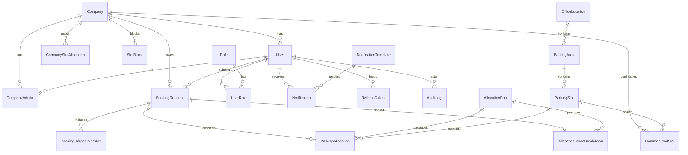

# Phase 2 — Database Design

**Database:** PostgreSQL · **ORM:** Prisma (target **6.x** — the `url = env("DATABASE_URL")` datasource
form; Prisma 7 moved this to `prisma.config.ts`, which the later backend phase can adopt if desired).
Schema: [`prisma/schema.prisma`](../prisma/schema.prisma). Seed: [`prisma/seed.ts`](../prisma/seed.ts).

> Built on the **quota slot model** (D2) and the resolutions in `docs/decisions.md`. Validated with
> `prisma validate` and `prisma migrate diff` (23 tables, 65 DDL statements).

---

## 1. Entity overview (23 models)

| Group | Models |
|-------|--------|
| Identity & tenancy | `Company`, `User`, `Role`, `UserRole`, `CompanyAdmin` |
| Physical inventory & quota | `OfficeLocation`, `ParkingArea`, `ParkingSlot`, `CompanySlotAllocation`, `SlotBlock` |
| Bookings | `BookingRequest`, `BookingCarpoolMember` |
| Allocation | `AllocationRun`, `ParkingAllocation`, `AllocationScoreBreakdown`, `CommonPoolSlot` |
| Calendar | `Holiday`, `WorkingDayConfiguration` |
| Notifications | `NotificationTemplate`, `Notification` |
| Cross-cutting | `AuditLog`, `SystemConfiguration`, `RefreshToken` |

### Key relationships (quota model)
- **Building → inventory:** `OfficeLocation` → `ParkingArea` → `ParkingSlot`. Slots are **not** owned by
  companies; they carry `slotType`/`status`/`hasEvCharging`/`isAccessible` (the last two stored but unused
  by MVP allocation — D5).
- **Company quota:** `CompanySlotAllocation` holds an **effective-dated count** per company. A quota change
  is a new row (`effectiveFrom`, optional `effectiveTo`), never a mutation — preserves history and supports
  future-dated changes.
- **Blocking:** `SlotBlock` blocks a **count** of a company's quota for a date range with an enum reason.
  Blocked count is excluded from allocation and from common-pool contribution.
- **Daily assignment:** `ParkingAllocation` binds one concrete `ParkingSlot` to one winning `BookingRequest`
  for a `bookingDate`. `CommonPoolSlot` is the per-date shared inventory derived from unused quota.
- **Explainability:** `AllocationScoreBreakdown` stores per-factor scores/weights + tie-breaker signals
  (1-1 with `BookingRequest`), so any allocation outcome can be justified.

---

## 2. ER diagram


*(`Holiday` and `WorkingDayConfiguration` link optionally to `Company`/`OfficeLocation`; a NULL company =
building-wide default. Omitted above for readability.)*

---

## 3. Index & constraint strategy

### Primary keys & timestamps
- All PKs are `cuid()` strings. All mutable tables carry `createdAt` (`@default(now())`) and `updatedAt`
  (`@updatedAt`); append-only tables (`AuditLog`, `UserRole`, carpool members) carry `createdAt` only.

### Uniqueness / duplicate protection
| Constraint | Purpose |
|------------|---------|
| `User.email @unique` | one account per email (**convert to partial unique** `WHERE deleted_at IS NULL` — F7) |
| `Company.code @unique`, `Role.name @unique` | natural keys |
| `ParkingSlot @@unique([parkingAreaId, slotNumber])` | slot numbers unique within an area |
| `BookingRequest @@unique([userId, bookingDate, bookingType])` | one PRIMARY + one COMMON_POOL request per user per date (refines F8 — a user may take a common-pool slot after a primary miss) |
| `BookingCarpoolMember @@unique([bookingDate, employeeEmail])` | same employee can't be in two carpools for a date (F4). NULL emails repeat freely (Postgres NULL semantics) |
| `ParkingAllocation @@unique([slotId, bookingDate])` | a slot → at most one user per date (F8) |
| `ParkingAllocation.bookingRequestId @unique` | a request → at most one allocation (1-1) |
| `AllocationScoreBreakdown.bookingRequestId @unique` | one breakdown per request (1-1) |
| `AllocationRun @@unique([runType, bookingDate])` | idempotent runs; safe re-run (F9) |
| `AllocationRun.idempotencyKey @unique` | external idempotency guard (F9) |
| `CommonPoolSlot @@unique([slotId, bookingDate])` | a slot appears once in a date's pool |
| `RefreshToken.tokenHash @unique` | token lookup + rotation (F10) |
| `WorkingDayConfiguration @@unique([companyId, dayOfWeek])` | one config per day per scope |

### Secondary indexes (reporting & hot paths)
`User(companyId)`, `User(status)`, `Company(status)`, `ParkingSlot(status)`,
`CompanySlotAllocation(companyId, effectiveFrom)`, `SlotBlock(companyId, startDate, endDate)`,
`BookingRequest(companyId, bookingDate)`, `BookingRequest(status)`, `BookingRequest(bookingDate)`,
`ParkingAllocation(companyId, bookingDate)`, `CommonPoolSlot(bookingDate, status)`,
`Notification(userId, status)`, `AuditLog(entityType, entityId)`, `AuditLog(createdAt)`, `Holiday(date)`.

### Foreign keys & delete behavior
- Composition edges use `onDelete: Cascade` where the child cannot exist without the parent
  (`UserRole`, `BookingCarpoolMember`, `RefreshToken`).
- Business entities (allocations, bookings, quotas) use the default `Restrict` — history must not vanish.
- Audit-style user references (`createdById`, `triggeredById`, `overrideById`, `assignedById`,
  `updatedById`) are **soft scalar references** (not FK relations), to avoid a large fan of back-relations
  on `User`; integrity is enforced in the service layer.

### Soft delete (F7)
`deletedAt` on `User`, `Company`, `ParkingSlot`. All read queries filter `deletedAt IS NULL` (enforced via
a Prisma extension/middleware in the code phase). The raw-SQL migration replaces the affected `@unique`
constraints with partial unique indexes.

### Concurrency (allocation — design note for code phase, F8)
The allocation service must run inside a serializable/`FOR UPDATE` transaction: lock candidate slots for the
`bookingDate`, insert `ParkingAllocation` rows, and rely on `@@unique([slotId, bookingDate])` as the final
DB-level backstop against double assignment even under concurrent/retried runs.

### Raw-SQL migration addendum (to apply after `prisma migrate`)
```sql
-- F7: partial unique indexes so soft-deleted rows don't block reuse
DROP INDEX IF EXISTS "User_email_key";
CREATE UNIQUE INDEX "User_email_active_key" ON "User"("email") WHERE "deletedAt" IS NULL;
```

---

## 4. Seed data ([`prisma/seed.ts`](../prisma/seed.ts))

Idempotent (`upsert`-based) seed covering the spec's required data:
- **Roles:** `SUPER_ADMIN`, `COMPANY_ADMIN`, `USER`.
- **Redbricks** platform context + **Super Admin** user (Redbricks admin).
- **Assent** company (`ACTIVE`) + **Assent Company Admin**.
- **Sample registered users** for Assent with varied manually-entered `distanceKm` values (D6).
- **OfficeLocation** (Redbricks building, Pune) + one **ParkingArea** + a set of **ParkingSlots**
  (mixed `slotType`, some EV/accessible).
- **CompanySlotAllocation** quota for Assent (effective today).
- **SystemConfiguration** defaults: allocation weights (`0.60`/`0.40`), window times
  (`18:00`/`20:00`/`22:00`/`23:00` IST), password rules, `allocation.maxDistanceKm` (40), `carpool.maxPeople` (4).
- **WorkingDayConfiguration** (Mon–Fri working, Sat/Sun off) + a sample **Holiday**.
- **NotificationTemplate** rows for the spec's notification events.

> Passwords in the seed are placeholder dev credentials hashed at runtime; **not for production**.

### Commands (runnable once the backend foundation + a Postgres instance exist — later phase)
```bash
npx prisma migrate dev --name init      # create tables from schema
psql "$DATABASE_URL" -f prisma/partial-unique.sql   # apply F7 addendum (optional in dev)
npx prisma db seed                      # run prisma/seed.ts
```

---

## 5. Verification performed
- `npx prisma@6 format` — formatted, no errors.
- `npx prisma@6 validate` — **schema is valid**.
- `npx prisma@6 migrate diff --from-empty --to-schema-datamodel` — 23 `CREATE TABLE` + indexes generated,
  DDL inspected for correctness (no live DB required).
